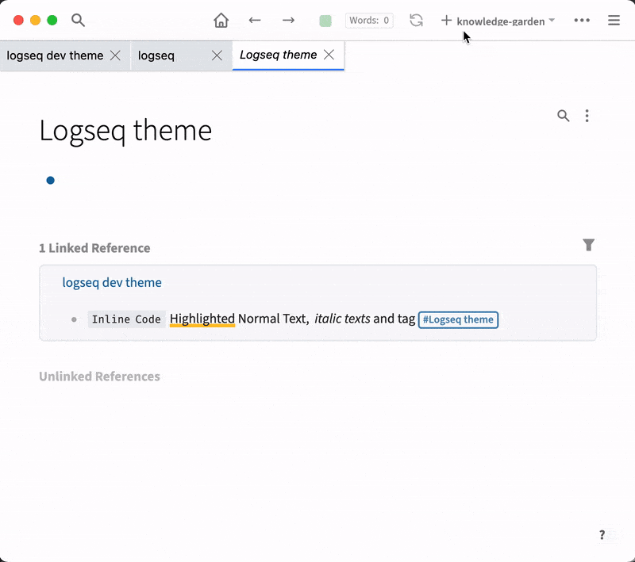
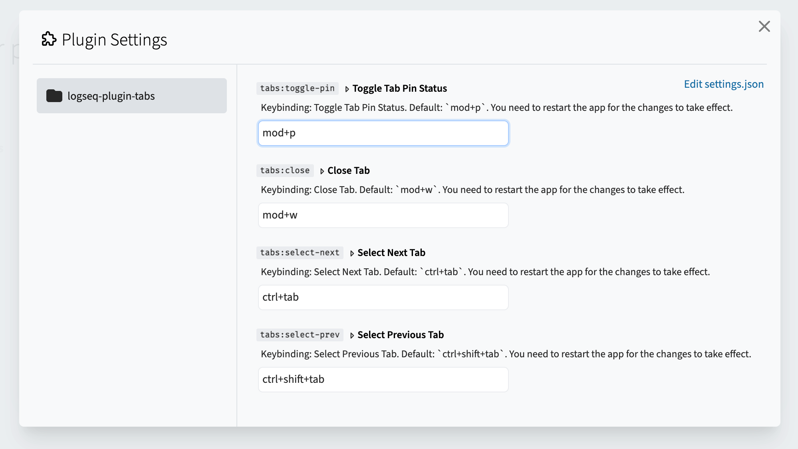

# Logseq Plugin Tabs

### 🔔 Looking for maintainers! 🔔

A plugin that let's you to manage your working pages with tabs.

UX is mainly brought from modern browsers:

- normally, if a new page is visited, the current tab will be replaced by the new page
- if you click a page link or a block ref while holding CTRL (or CMD on Mac) key, a new tab will be created, but it is not visited yet
- you can click the remove icon or middle click a tab to close tabs
- you can double-click a tab to pin it. A pinned tab will not be replaced or be removed.
- you can drag & drop to reorder tabs
- tabs info will be persisted in your local storage, so that your tabs will recover even if you re-open the app

## Keyboard shortcuts

- Pin/unpin a tab: <kbd>CTRL</kbd> + <kbd>P</kbd> (macOS: <kbd>CMD</kbd> + <kbd>P</kbd>)
- Close a tab: <kbd>SHIFT</kbd> + <kbd>CTRL</kbd> + <kbd>W</kbd> (macOS: <kbd>SHIFT</kbd> + <kbd>CMD</kbd> + <kbd>W</kbd>)
- Change to next tab: <kbd>CTRL</kbd> + <kbd>TAB</kbd>
- Change to nth tab: <kbd>CTRL</kbd> + <kbd>1</kbd> ~ <kbd>9</kbd> (this is not configurable yet)

Hint: you can change them in the Settings. After change, you need to restart the app.

